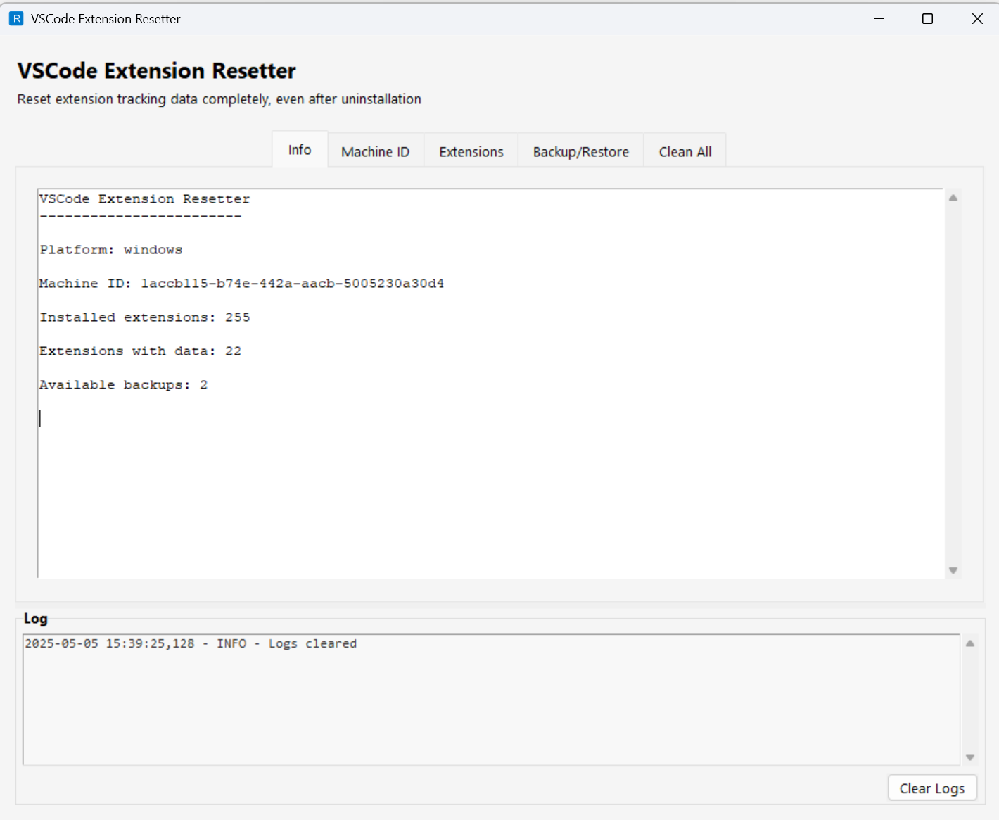

# VSCode Extension Resetter

A tool to completely remove extension tracking in Visual Studio Code, even after uninstallation.



## Features

- **Machine ID Reset**: Reset VSCode's machine ID to prevent extension tracking
- **Extension Data Cleaning**: Remove tracking data for specific extensions
- **Backup & Restore**: Create backups before making changes and restore if needed
- **Extension Selection**: List installed extensions and selectively reset them
- **Cross-Platform Support**: Works on Windows, macOS, and Linux
- **User-Friendly Interface**: Both command-line and graphical interfaces

## Quick Start

```bash
# Clone the repository
git clone https://github.com/sumant4ssm/vsode-extension-resetter.git
cd vsode-extension-resetter

# Install dependencies
pip install -r requirements.txt

# Run the GUI
python run_gui.py

# Or use the CLI
python run_cli.py info
```

## Usage

### Command Line Interface

```bash
# Show information about the current VSCode installation
python run_cli.py info

# Reset machine ID
python run_cli.py reset-machine-id

# List installed extensions
python run_cli.py list-extensions

# Reset a specific extension's data
python run_cli.py reset-extension <extension-id>

# Reset data for all extensions
python run_cli.py reset-all-extensions

# Create a backup
python run_cli.py backup

# Restore from a backup
python run_cli.py restore <backup-id>

# Clean all VSCode tracking data
python run_cli.py clean-all
```

### Graphical User Interface

```bash
python run_gui.py
```

The GUI provides an easy-to-use interface with tabs for:
- Information about your VSCode installation
- Machine ID management
- Extension data management
- Backup and restore functionality
- Complete cleaning options

## Documentation

For more detailed information, see the [documentation](docs/README.md).

## Requirements

- Python 3.6+
- Visual Studio Code installed
- Required Python packages (see requirements.txt)

## Contributing

Contributions are welcome! Please feel free to submit a Pull Request.

## License

This project is licensed under the MIT License - see the [LICENSE](LICENSE) file for details.

## Disclaimer

This tool is provided for educational purposes only. Use at your own risk. Always create a backup before making changes.
